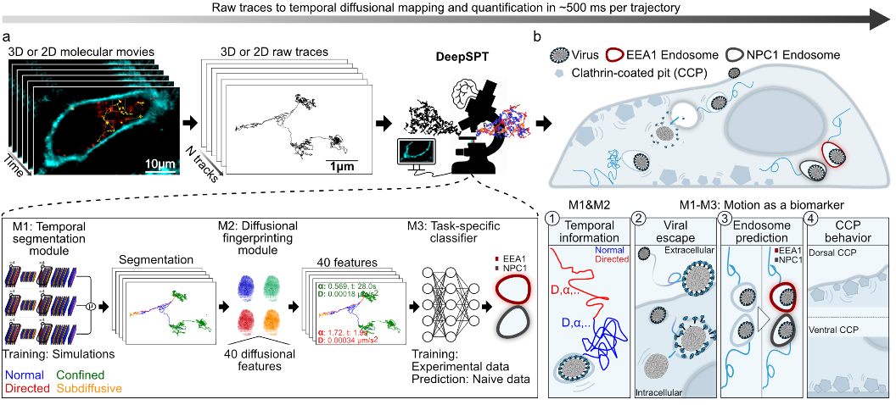

# DeepSPT
## Deep Learning Assisted Analysis of Single Particle Tracking for Automated Correlation Between Diffusion and Function
DeepSPT, a deep learning framework to interpret the diffusional 2D or 3D temporal behavior of objects in a rapid and efficient manner, agnostically. DeepSPT is a deep learning framework, encompassing three sequentially connected modules: A temporal behavior segmentation module; a diffusional fingerprinting module; and a task-specific downstream classifier module (Fig. 1a). The first two modules are universal, applicable directly to any trajectory dataset characterized by x, y, (z) and t coordinates across diverse biological systems. The final module capitalizes on experimental data to learn a task that is specific to the system under investigation.


### Citing
https://www.biorxiv.org/content/10.1101/2023.11.16.567393v1
Check updated status of the publication: https://scholar.google.dk/citations?user=og-0z0wAAAAJ&hl=da

### Usage
#### Installation
DeepSPT's installation guide utilize conda environment setup, therefore either miniconda or anaconda is required to follow the bellow installation guide.
 - Anaconda install guide: [here](https://www.anaconda.com/download)
 - Mini conda install guide: [here](https://docs.conda.io/en/latest/miniconda.html)

DeepSPT is most easily setup in a new conda environment with dependecies, versions, and channels found in environment_droplet.yml - Open Terminal / Commando prompt at wished location of DeepSPT and run the bash commands below, which creates the environemnt, downloades and installs packages, typically in less than 5 minutes. The code has been tested both on MacOS and Linux operating systems.

```bash
git clone git@github.com:JKaestelHansen/DeepSPT.git
cd DeepSPT
conda env create -f environment_droplet.yml
conda activate DeepSPT
pip install probfit==1.2.0
pip install iminuit==2.11.0
```
DeepSPT modules and additional/helpful functions are contained in the `deepspt_src` folder.
When running/building scripts in the DeepSPT directory modules are imported as:
```python
from deepspt_src import *

```
Three test python scripts are provided:
  - `simulate_diffusion.py` - Data generation of 2D or 3D diffusion of heterogeneous/homogeneous motion.
  - `usage_example0.py` - Usage example for loading numpy array saved as pickle or csv file.
  - `usage_example1.py` - Usage example for the three DeepSPT modules: Temporal segmentation, diffusional fingerprinting and task-specific classifier module on simulated data. This code transforms trajectories by temporal segmentation of diffusion and provide diffusional fingerprints to generate feature representation of trajectories both in the form of NumPy arrays. Runtime depends on dataset size but runs in less than 10 minutes for typical data volumes.
  - `usage_example2.py` - Usage example for the three DeepSPT modules: Temporal segmentation, diffusional fingerprinting and task-specific classifier module for time-resolved classification on simulated data. This code transforms trajectories by temporal segmentation of diffusion and provide diffusional fingerprints both in a temporal manner and returns the representations in the form of NumPy arrays. Runtime depends on dataset size but runs in less than 10 minutes for typical data volumes.

### For demostration
For demostration regarding presented data and analysis contained in the manuscript, please refer to the `_For_puplicaiton` folder where you will find the required information and scripts. To run on the same data download the data as outlined below.

### Data
  - Your own: DeepSPT accepts csv files or numpy arrays of shape (number of tracks, x,y,(z)).
  - Simulated data: simulate_diffusion.py, usage_example.py, and usage_example2.py (WIP) contains functions to simulate trajectories.
  - To access data of the publication "Deep learning assisted Single Particle Tracking for automated correlation between diffusion and function" please download from: TBA. Please extract .zip files in place of folders with the same names.

### Files
  - For_publication: Scripts as used in "Deep Learning Assisted Analysis of Single Particle Tracking for Automated Correlation Between Diffusion and Function". Folders with data and precomputed files are available, see Data availability.
  - _Images: Contains figure seen in Readme. Copyrighted as detailed in journal carrying "Deep learning assisted Single Particle Tracking for automated correlation between diffusion and function".
  - deepspt_mlflow_utils: MLflow helper functions
  - deepspt_src: Source code for DeepSPT
  - environment_droplet.yml: requirements file for installation of virtual environment.

### Runnng on data from publication
- Firstly, download all data and code as stated in the "Data availability" section in "Deep Learning Assisted Analysis of Single Particle Tracking for Automated Correlation Between Diffusion and Function". Roughly 117 GB in zipped version.
-  Secondly, follow the install instructions described above.
-  Thirdly, the folder "_For_publication" contains all scripts used for the publication and running these will completely reproduce all results. Specifically, temporalsegm_eval.py contains most code for figure 2, timeresolved_uncoating_prediction.py contains most code for figure 3, and benchmark_for_fig4.py contains most code for figure 4.
  
### Contact

Jacob Kæstel-hansen, PhD fellow\
Department of Chemistry\
jkh@chem.ku.dk

Nikos Hatzakis, Professor\
Department of Chemistry\
hatzakis@chem.ku.dk

or commit an issue to this github. 
